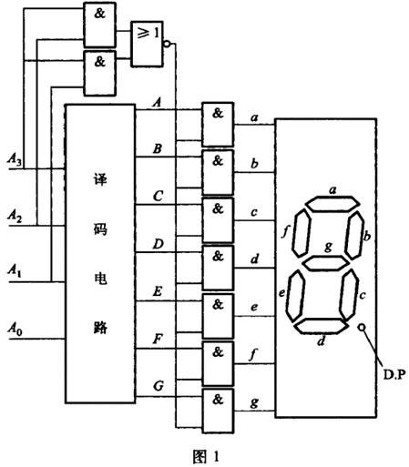

# 2023年先锋网络中心招新面试前考核
考前须知：

严格保密，不要泄露自己的解题思路和做题过程，从现在开始到加入先锋，竞争已经开始了！基础事务站的同学可以看下基础事务站的要求，带作品参加面试不用做题。

&emsp;&emsp;先锋并不是传统的组织，不能用传统的眼光看待她，你会在这里接触到各种？的学长、朋友，从前日谈、后日谈感受下先锋的魅力吧！（真的吗）  
&emsp;&emsp;本次面前题共分为：前日谈、整活题、面前题、后日谈四部分，前日、后日谈和整活题主要是学长们的碎碎念和一些学习建议（或者发癫），面前题主要为后面的面试做准备，以引导为主，可以选择一道题深入研究一下，并分享一下研究心得，不追求全部做完，追求一个研究的过程，<font color=red>面试时会根据面前题来准备一些小问题，面前题起个引导学习的作用，同时也给面试提供话题，面试题不做也能参加面试，但是面试时就可能陷入被动，</font>所以大家静下心来好好准备，有所收获才是最重要的！  
&emsp;&emsp;感谢各位先锋成员对本次招新的帮助，往前可追溯至13级学长，主力是22级部长团成员，爱生活！爱先锋喵！                                                            
<p align="right">---主席</p>

---
## I.前日谈（别忘了看后日谈，可以直接跳转面前题）


不要因为面前题自己没见过就觉得没机会了，我们出面前题不仅是看看大家有没有基础，**更重要的是看大家对学习软硬件知识的积极性**，面前题可以通过查找资料来解决，学会查找资料也是一项很重要的技能，主动去查找资料也能体现你的学习积极性哦，这也是面试的加分项。并不是说都要做下来，尽自己的能力去做就好。来面试就赢了一半了哦。（byd写这么多是吧）

~~你这玩意应该放后日谈~~

~~那题都没看完就把人家吓跑了~~

~~所以前面活跃气氛~~

氵贴：等通知：）

面前题滞销，帮帮我们！

爬，今年不招新了 :)

+3

要成功，先发疯，不顾一切向前冲，拼一次，富三代，拼命才能不失败，今天睡地板，明天当老板，开工!

关注嘉然，顿顿解馋

↑塌房了 乐

对于非洲人来说，黑丝算肉色丝袜吗？

不算，厚度不一样doge

川大是孙笑川大学吗?

不如孙笑川大学

秋裤为什么在冬天穿？

你春天不穿？

以下哪个是小猫的意思：

A.哈基米	B. 哈比下	C.阿米诺斯	D. ねこ

D哪来的梗小鬼，拖出去

多想想题咋出，或者题里面适当玩梗

对不起,做不到

做不到就..

艾草

我永远喜欢御坂美琴

我是早濑优香单推人(优香可爱)

我是木更小姐的狗

~~想进社团必须：七月新番看mygo（）（触发关键词是吧）~~

**为了拯救濒临解散的先锋网络部，老东西们决定……**

**先锋姬C位出道当偶像！（结果参考us）**

*老东西能爆点金币吗*


---
## II.整活题（顾名思义，不要求做仅为放松，也可以研究一下）
### 1. 编写一个检测屏幕出现大面积白色区域就启动原神的程序。要求

    1. 自动寻找电脑内已安装的原神  
    2. 启动时播放音乐
### 2. 在Minecraft使用红石实现七段数码管译码电路设计。要求：

    1. 在Minecraft中设计一个七段数码管译码电路，基本功能参考图1（不限于图1所示）。  
    2. 使用4个拉杆作为4位二进制数字输入。  
    3. 使用红石灯模拟数码管作为输出。

### 3. 某二字氪金抽卡游戏的祈愿规则如下：

5星角色祈愿的基础出率为 0.600% 。 4星角色祈愿的基础出率为 5.100% ，综合出率（含保底）为 13.000% ，最多 10 次祈愿必定能通过保底获取4星或以上角色，假设每次抽卡都互相独立。  
1. **在不考虑保底机制（即到一定抽数后概率提升）的情况下，首次抽出5星角色时，平均消耗多少抽？**

    在本期祈愿中，5星角色祈愿的基础概率为0.600%。

    本期祈愿奖池中的5星角色一共有8位，其中有1位是UP角色。当祈愿获取到5星角色时，有50.000%的概率为本期5星UP角色。如果本次祈愿获取的5星角色非本期5星UP角色，下次祈愿获取的5星角色必定为本期5星UP角色。  

2. **在不考虑保底机制的情况下，玩家首次抽出5星UP角色时，平均消耗多少抽？**

    该游戏中的保底，并不是硬性保底，而是分段的线性概率递增：在一直不出5星的情况下，1~73抽是0.6%的5星率，74及以后每一抽依次递增6%的5星率，直至90抽为100%。在概率增长期间抽出5星角色后，抽出5星角色的概率还原为0.6%。  
3. **在考虑这种软性保底机制的情况下，首次抽出5星角色时，平均消耗多少抽？**

4. **一个玩家刚刚进入本期卡池，他一共可以抽取80次。他想抽出2次本期5星UP角色。请问你觉得他成功实现愿望的概率有多大？请说说你的理由。**

---
## III.这才是真正的面前题

### 1.网络部

### 1.1. 实操题（克服畏难情绪，大胆操作）

#### 1. 学习 Git 基本操作

#### 2. 在虚拟机内安装Ubuntu任一发行版，要求：

a. 可以面试时带电脑展示实物，也可以将详细过程整理为博客，发布在csdn等网站上附链接；  
b. 不使用IDE，在Windows下编译任意程序  
c. 附加分项：

- 在Linux下编译任意项目

- 编译下面链接里的项目（需要讲一下涉及到的工具是干什么的）

- 链接 [https://github.com/hundan2015/ReflectiveShadowMapsRemake](https://github.com/hundan2015/ReflectiveShadowMapsRemake)

#### 3.[正则表达式] 使用正则表达式匹配如下信息，并解释你写出的每一个字符:

- 邮箱地址  
- IP 地址  
- 汉字  
- URL  

#### 4.请自学网络协议相关知识，使用任意编程语言实现客户端，实现以下内容中部分内容:

a. 使用TCP协议连接47.93.236.205:30000发送学号和姓名（如果姓名中间有空格或特殊字符，请写在一起不要用空格和特殊字符，<font color=red>中文请使用UTF-8编码</font>,例ABCD·ABCD应写为ABCDABCD），使用空格分隔，以\n结尾，接收并打印服务端返回的信息。  

例:

```
20230001 砂狼白子\n
```  

b. 使用UDP协议连接47.93.236.205:30001发送学号和姓名，使用空格分隔，以\n结尾。  

例：

```
20230001 砂狼白子\n
```  

c. 使用HTTP协议向http://47.93.236.205:30002/neup 使用JSON格式发送POST请求，内容为学号和姓名，接收并打印响应信息。

例:

```json
{
    "name": "砂狼白子",
    "number": 20230001
}
```

d. 使用WebSocket协议连接ws://47.93.236.205:30002/neup_ws发送学号和姓名，使用空格分隔，以\n结尾，接收并打印服务端返回的信息。  

例：
```
20230001 砂狼白子\n
```

#### 5、实现一个可以存储简单 Key - Value 的数据库
1. 用任意语言实现一个my-db程序，实现如下功能 ，这一个步骤不要求进程重启后，数据还在 

    - 能够启动一个交互式的 prompt，用户输入 command 和 arguments 与 DB 进行交互，类似 redis(如果不知道 redis 是什么，可以去查) 
    - 能够支持基本的 写入 (put) 删除(del) 读取(get) 操作，除了下面例子中给出的场景，请尽量考虑一些 extended case （提示：比如 put 的时候 key 已经 put 过了，你要如何处理）
    - 对于每个 operation，输出一行结果 

```sh
# Start Database 交互
./my-db
> 
# Put a Key Value into db
> put <my_key> <my_value>

# Get a Key from db
> get <my_key> 

# Delete a Key from db
> del <my_key>

# Example
put 3 2 --> printout "OK"
get 3 --> printout "key:3 value:2"
del 3 --> printout "OK"
get 3 --> printout "NOT_FOUND"
```

2. **[advanced]** 在 a 的基础上，支持将数据持久化存储，保证进程重启的情况下，写入的数据还在，你需要在启动 my-db 时，指定一个参数 --db=/path/to/your/db 来读取之前持久化的数据 
3. **[nightmare]** 将 my-db 改造为一个服务端-客户端程序，然后通过 ./my-cli 链接 my-db ，经由 ./my-cli 发送命令( 参考上面 TCP 的题目）给 my-db ，由 my-db 返回数据 (类似 mysql 服务端 和 mysql 客户端)

#### 6. 用任意语言实现一个简易 grep 工具，先试用一下 grep 工具，了解下用法 

1. 使用 grep 工具，从一个大文本中，找出含有 "walk" 的行，并输出到屏幕上 
2. 实现简易的 grep 工具 my-grep, 能够支持从一个文件中，找出给定的字符串，不含通配符(*, ?), 使用方式:(30')

```sh
./my-grep <word> <file>
```

3. 将输出的匹配到的字符串 highlight 在终端里
4. **[advanced]** 实现进阶版 grep 工具，支持简单通配符 (.), 比如，给定一个文件含有 "my old box", 指定 <word> 为 `bo.` 的情况下，可以匹配到这一行, 指定 <word> 为 `o..` 的时候，可以匹配到这一行

#### 7. 图片文件能够存储大量信息，思考怎样在图片文件中隐藏信息，学习图片文件的相关知识，想出几种在图片文件中隐藏信息的方法，在面试时熟练运用解决问题。

### 1.2. 算法思维培养

自学计算机二进制编码、笛卡尔坐标系、三维坐标系等相关知识，培养算法思维，从数学开始：）

### 2. 硬件部

#### 2.1. 配置单

出一套配置单，500元能开机，后续面试中请详细讲述下选择各个配置的理由，加分项:可以启动原神（能玩就行，主要考察对硬件的理解程度，鼓励探索低价装机DIY）

#### 2.2. 知识储备

了解笔记如何拆机及主板构造，及可更换的部分，熟练掌握各个主流品牌笔记本特点，Nvidia、Intel、AMD等厂商的主流产品的优势区间。固态硬盘区别（例如2230，2242，2280，m.2 sata等）

#### 2.3. 动手实操

自己制作一个pe盘(没有条件的可以了解制作过程)。自己写一个搭建NAS的详细流程。

加分项：尝试自己搭建一个NAS（没有硬件可以使用虚拟机进行搭建）

#### 2.4. 硬核芝士

可了解或学习ECC内存的纠错原理，固态硬盘的缓存机制，显示器背光、面板的种类及其优缺点，内存优先插2、4槽的原因，各种NAS系统及文件系统的优缺点等（以上科普均有视频讲解）。

加分项：可选一个在面试时进行简略介绍。

### 3. 基础事务站
#### 3.1. 美工部

掌握基本ps操作，能独立制作宣传海报，可以带自己的作品参加面试，也可以直接参加面试。

#### 3.2. 办公室

熟练使用各种办公软件，能够连接各个部门，有管理经验优先，直接参加面试。

#### 3.3. 推广部

参加过宣传工作，能够撰写宣传文案，直接参加面试。

## IV.后日谈（升华！）:


秋风带来了技术的种子，先锋使之发芽。

在先锋，你的收获更加取决于你的求知，我们只是引路人。各种面前题，都是人类智慧的沧海一粟，都是你想要在计算机这一美妙的领域更进一步的必需。我们希望，无论是否加入先锋，你能够保持学习，能够永远永远开拓下去！

人类的赞歌是勇气的赞歌，人类的伟大是勇气的伟大。（哪来的JO厨）而人类最大的勇气在于，明知不可为而为之，即使真的不会，那就去努力弄会他！我们可能是你的引路人，但兴趣永远是你最棒的老师！

只要不失去你的崇高，整个先锋都会为你敞开大门！（什么op）

其实先锋并不是一个那么“正经”的组织，相反，先锋鼓励大家去学习，去探索，虽然很多人说我们是只搞技术的（不过还真是搞技术的），调很高，但“曲高未必人不识”，我们先锋的目标，可是远方的那星辰大海，红缨猎猎箭流星，共筑先锋扬帆起!